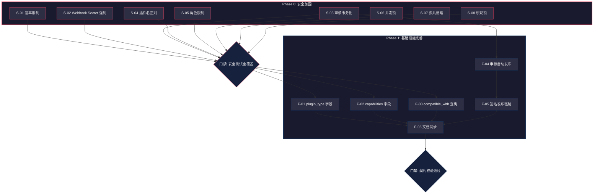

# 下一阶段：安全加固 & 基础设施完善

> **版本**: v2 — 替代已全部完成的 v1（代码质量修复）  
> **创建日期**: 2026-03-06  
> **适用仓库**: sub2api-plugin-market (控制平面)  
> **前置文档**: [04-PLUGIN-MARKET-REVIEW.md](./plugin-architecture/04-PLUGIN-MARKET-REVIEW.md)、[05-EXTRACTION-ROADMAP.md](./plugin-architecture/05-EXTRACTION-ROADMAP.md)

---

## 一、v1 已完成项回顾

> 上一轮共完成 17 项修复（2026-03-06），包括：
> - P0: admin 路由顺序、集成测试编译、untracked 文件入库
> - P1: 统一错误响应、slog 结构化日志、查询优化、goroutine 上下文、真实 GitHub 同步、密钥热加载
> - P2: Repository 层补齐、DB 端口一致、核心单元测试（18 用例）、集成测试（9 用例）
>
> 当前状态：`go build` + `go test -short ./...` 全量通过（71 个测试，0 失败）

---

## 二、本轮目标

```
Phase 0 — 安全加固           修复评审发现的安全漏洞与数据完整性问题
Phase 1 — 基础设施完善       补齐缺失字段和 API 能力，让插件市场真正可用于分发
```

---

## 三、Phase 0 — 安全加固（优先级最高）

### S-01 🔴 POST /submissions 增加速率限制

| 项目 | 内容 |
|------|------|
| **文件** | `internal/api/v1/router.go`，新增 `internal/api/v1/middleware/rate_limit.go` |
| **问题** | `POST /submissions` 无任何认证，任何人可无限提交，易被滥用（垃圾提交、恶意占名） |
| **影响** | 数据库被灌垃圾、插件名被恶意占用 |
| **修复方案** | 实现 IP 级滑动窗口限流中间件，默认 10 次/分钟，挂载到 submissions 路由 |

**实现要点：**
- 使用 `sync.Map` + 时间窗口实现内存限流（MVP 阶段，无需 Redis）
- 配置可通过环境变量 `SUBMISSION_RATE_LIMIT` 调整
- 返回 `429 Too Many Requests` + `Retry-After` 头
- 限流 key 使用 `X-Forwarded-For` 或 `RemoteAddr`

**验证用例：**

| # | 场景 | 预期结果 |
|---|------|---------|
| 1 | 正常提交 1 次 | 200 成功 |
| 2 | 同一 IP 连续提交 11 次/分钟 | 第 11 次返回 429 |
| 3 | 不同 IP 各提交 10 次 | 均成功，互不影响 |
| 4 | 等待窗口滑过后重试 | 恢复正常 |

---

### S-02 🔴 Webhook Secret 生产环境强制校验

| 项目 | 内容 |
|------|------|
| **文件** | `internal/api/v1/handler/github_webhook_handler.go` |
| **问题** | `secret == ""` 时跳过 HMAC 签名校验，生产环境未配置 secret 导致 webhook 端点可被任意伪造 |
| **影响** | 攻击者可伪造 webhook 触发恶意同步 |
| **修复方案** | `GIN_MODE=release` 时，secret 为空则拒绝所有 webhook 请求；开发模式下保留跳过以方便调试 |

**验证用例：**

| # | 场景 | 预期结果 |
|---|------|---------|
| 1 | release 模式 + secret 为空 | 返回 403，message 提示需配置 |
| 2 | release 模式 + secret 已配置 + 签名正确 | 正常处理 |
| 3 | release 模式 + secret 已配置 + 签名错误 | 返回 400 |
| 4 | debug 模式 + secret 为空 | 正常处理（兼容开发） |

---

### S-03 🔴 审核操作事务化

| 项目 | 内容 |
|------|------|
| **文件** | `internal/admin/service/submission_service.go` |
| **问题** | `ReviewSubmission` 先更新 Submission 再更新 Plugin，无事务包裹。Plugin 更新失败时 Submission 状态已变更，造成数据不一致 |
| **影响** | 审核状态和插件状态可能不同步 |
| **修复方案** | 使用 `client.Tx()` 将 Submission 状态更新 + Plugin 字段更新 + PluginVersion 发布包裹在同一事务中 |

**验证用例：**

| # | 场景 | 预期结果 |
|---|------|---------|
| 1 | 审批通过 → Submission + Plugin 均更新成功 | 事务提交 |
| 2 | 审批通过 → Plugin 更新失败（模拟错误） | 事务回滚，Submission 保持 pending |
| 3 | 拒绝 → 仅 Submission 更新 | 事务提交，Plugin 不受影响 |

---

### S-04 🟡 插件名正则校验

| 项目 | 内容 |
|------|------|
| **文件** | `ent/schema/plugin.go` 或 `internal/service/submission_service.go` |
| **问题** | `name` 仅 `NotEmpty()` 校验，未限制 `/`、`..` 等特殊字符。Sync 使用 `fmt.Sprintf("plugins/%s/..."` 拼接存储路径，恶意 name 可导致路径遍历 |
| **影响** | 存储路径越界，可能覆盖其他插件文件 |
| **修复方案** | 在 service 层（`CreateSubmission`）添加正则 `^[a-z0-9][a-z0-9-]{0,62}[a-z0-9]$`，最短 2 字符，最长 64 字符 |

**验证用例：**

| # | 输入 | 预期结果 |
|---|------|---------|
| 1 | `my-plugin` | ✅ 通过 |
| 2 | `claude-provider` | ✅ 通过 |
| 3 | `../hack` | ❌ 被拦截 |
| 4 | `plugin/../../etc` | ❌ 被拦截 |
| 5 | `-invalid` | ❌ 被拦截（不能以 `-` 开头） |
| 6 | `a` | ❌ 被拦截（至少 2 字符） |
| 7 | `ab` | ✅ 通过（最短合法） |

---

### S-05 🟡 Official 插件审核角色限制

| 项目 | 内容 |
|------|------|
| **文件** | `internal/admin/handler/submission_handler.go` 或 `internal/admin/service/submission_service.go` |
| **问题** | 审核路由仅用 `AdminAuth` 中间件，未区分角色。reviewer 角色可审核 `is_official=true` 的官方插件 |
| **影响** | 权限控制粒度不够，官方插件的审核应仅限高权限管理员 |
| **修复方案** | 审核时检查：若插件 `is_official=true`，则 reviewer 仅允许 `super_admin` 或 `admin` 角色操作 |

**验证用例：**

| # | 场景 | 预期结果 |
|---|------|---------|
| 1 | super_admin 审核 official 插件 | ✅ 成功 |
| 2 | admin 审核 official 插件 | ✅ 成功 |
| 3 | reviewer 审核 official 插件 | ❌ 403 Forbidden |
| 4 | reviewer 审核非 official 插件 | ✅ 成功 |

---

### S-06 🟡 SyncJob 并发锁

| 项目 | 内容 |
|------|------|
| **文件** | `internal/service/sync_service.go` |
| **问题** | 手动 Sync（Admin 触发）和自动 Sync（Webhook 触发）可同时执行 `runGitHubSync`。`versionAvailable` 检查与 `Create` 之间无锁，可产生重复版本或孤儿 WASM |
| **影响** | 数据重复，存储浪费 |
| **修复方案** | 使用 `sync.Map` 实现进程内 `(plugin_id, target_ref)` 级别的互斥锁。获取锁失败时 SyncJob 标记为 `failed` 并说明原因 |

**验证用例：**

| # | 场景 | 预期结果 |
|---|------|---------|
| 1 | 同一 `(plugin_id, ref)` 并发两个 Sync | 一个执行，一个 `failed: concurrent sync in progress` |
| 2 | 不同 `(plugin_id, ref)` 并发 | 均正常执行 |
| 3 | 首个 Sync 完成后重试 | 正常执行 |

---

### S-07 🟡 SyncJob 失败清理孤儿 WASM

| 项目 | 内容 |
|------|------|
| **文件** | `internal/service/sync_service.go` |
| **问题** | 当前执行顺序为「上传 WASM → 检查版本 → 创建版本」，Create 失败时 WASM 已写入存储成为孤儿 |
| **影响** | 存储空间浪费 |
| **修复方案** | 调整为「检查版本 → 上传 WASM → 创建版本」，若创建版本失败则调用 `storage.Delete` 清理已上传文件 |

**验证用例：**

| # | 场景 | 预期结果 |
|---|------|---------|
| 1 | Sync 成功 | WASM 保留，版本创建成功 |
| 2 | 版本已存在（重复 Sync） | 跳过上传，无孤儿 |
| 3 | 创建版本失败（模拟错误） | WASM 被清理 |

---

### S-08 🟡 审核接口乐观锁

| 项目 | 内容 |
|------|------|
| **文件** | `internal/admin/service/submission_service.go` |
| **问题** | 两个管理员同时审核同一 Submission 时，无乐观锁，后者覆盖前者 |
| **影响** | 审核结果不可控 |
| **修复方案** | 审核前条件查询 `WHERE status = 'pending'`，使用 `Update().Where(submission.StatusEQ(submission.StatusPending))` 确保仅 pending 状态可被审核 |

**验证用例：**

| # | 场景 | 预期结果 |
|---|------|---------|
| 1 | 正常审核 pending 提交 | 成功 |
| 2 | 审核已 approved 的提交 | 返回错误「已被处理」 |
| 3 | 两个管理员并发审核 | 仅一个成功，另一个返回错误 |

---

## 四、Phase 1 — 基础设施完善

### F-01 Plugin Schema 增加 `plugin_type` 字段

| 项目 | 内容 |
|------|------|
| **文件** | `ent/schema/plugin.go` + `make generate` |
| **问题** | Plugin 无类型字段，市场无法按类型（Interceptor / Transform / Provider）筛选 |
| **修复方案** | 新增 `field.Enum("plugin_type").Values("interceptor", "transform", "provider").Optional()` |

**联动更新：**
- `openapi/plugin-market-v1.yaml` 的 Plugin schema
- 列表 API `GET /plugins` 增加 `?type=provider` 筛选参数
- `internal/repository/plugin_repository.go` 增加筛选逻辑
- `internal/service/plugin_service.go` 透传参数
- `internal/api/v1/handler/plugin_handler.go` 解析查询参数

---

### F-02 PluginVersion 增加 `capabilities` 字段

| 项目 | 内容 |
|------|------|
| **文件** | `ent/schema/plugin_version.go` + `make generate` |
| **问题** | 版本元数据无能力声明，客户端不知道安装后插件需要哪些 Host API |
| **修复方案** | 新增 `field.JSON("capabilities", []string{}).Optional().Comment("所需 Host API 能力列表")` |

---

### F-03 版本 API 兼容性查询

| 项目 | 内容 |
|------|------|
| **文件** | `internal/api/v1/handler/plugin_handler.go`、`internal/repository/plugin_repository.go` |
| **问题** | `GET /plugins/:name/versions` 返回所有版本，客户端需自行判断兼容性 |
| **修复方案** | 支持 `?compatible_with=1.2.0`，服务端按 `min_api_version <= param` 过滤 |

**验证用例：**

| # | 场景 | 预期结果 |
|---|------|---------|
| 1 | `?compatible_with=1.0.0`，版本 min=0.9.0 | 返回 |
| 2 | `?compatible_with=0.5.0`，版本 min=1.0.0 | 不返回 |
| 3 | 不传参数 | 返回全部（向后兼容） |

---

### F-04 审核通过自动发布版本

| 项目 | 内容 |
|------|------|
| **文件** | `internal/admin/service/submission_service.go`、`ent/schema/submission.go`（可能需新增 `version_id` 关联） |
| **问题** | 当前 Submission 审批通过后不联动 PluginVersion 发布。审核通过后还需手动操作版本才能可下载 |
| **修复方案** | `ReviewSubmission` 中，approved 时若关联了 PluginVersion，自动将其 `status=published` + `published_at=now` |

**前置工作：** 需先建立 Submission → PluginVersion 的关联（当前 Submission 只关联 Plugin，未关联版本）

---

### F-05 Sync→签名→发布流程设计

| 项目 | 内容 |
|------|------|
| **文件** | `internal/service/sync_service.go`、`internal/service/verification_service.go` |
| **问题** | 当前 Sync 创建的版本 `status=draft`、`signature=""`，无法通过验签下载。GitHub 同步的版本处于死胡同 |
| **修复方案** | 设计并实现完整的 Sync→签名→发布链路 |

**链路设计：**

```
GitHub Release
    │
    ▼
runGitHubSync
    ├── 下载 .wasm
    ├── 计算 SHA256
    ├── 上传 MinIO
    ├── 创建 PluginVersion (status=draft, signature="")
    │
    ▼
签名步骤（新增）
    ├── 从 TrustStore 获取签名密钥
    ├── 生成 Ed25519 签名
    ├── 更新 PluginVersion (signature=xxx, sign_key_id=yyy)
    │
    ▼
发布步骤
    └── 更新 PluginVersion (status=published, published_at=now)
```

**注意：** 签名需要私钥，市场控制平面可使用「官方密钥对」签名自动同步的版本。需要配置 `PLUGIN_SIGNING_PRIVATE_KEY` 环境变量。

---

### F-06 同步更新 OpenAPI Spec 和错误码文档

| 项目 | 内容 |
|------|------|
| **文件** | `openapi/plugin-market-v1.yaml`、`docs/ERROR-CODE-REGISTRY.md` |
| **问题** | F-01~F-05 的变更需要同步更新 API 契约文档 |
| **修复方案** | 更新 OpenAPI schema（plugin_type、capabilities、compatible_with 参数），更新错误码文档中已过时的 Admin API 描述 |

---

## 五、实施执行清单

> **规则**：逐项执行，完成后在 `[ ]` 中打 `x`，填入实际完成日期。

### Phase 0: 安全加固（预计 1-2 周）

- [ ] **S-01** POST /submissions 增加 IP 级速率限制
  - 完成日期：____
  - 验证：连续 11 次提交，第 11 次返回 429
- [ ] **S-02** Webhook Secret 生产环境强制校验
  - 完成日期：____
  - 验证：release 模式 + 空 secret → 403
- [ ] **S-03** 审核操作事务化（`client.Tx()`）
  - 完成日期：____
  - 验证：模拟 Plugin 更新失败，Submission 状态回滚
- [ ] **S-04** 插件名正则校验
  - 完成日期：____
  - 验证：`../hack` 被拦截
- [ ] **S-05** Official 插件审核角色限制
  - 完成日期：____
  - 验证：reviewer 审核 official 插件 → 403
- [ ] **S-06** SyncJob 并发锁
  - 完成日期：____
  - 验证：同一 `(plugin_id, ref)` 并发两个 Sync → 仅一个执行
- [ ] **S-07** SyncJob 失败清理孤儿 WASM
  - 完成日期：____
  - 验证：创建版本失败时 WASM 被清理
- [ ] **S-08** 审核接口乐观锁
  - 完成日期：____
  - 验证：审核已 approved 的提交 → 返回错误
- [ ] **门禁** `go build` + `go test -short ./...` 全量通过 + 安全测试用例全覆盖

### Phase 1: 基础设施完善（预计 2-3 周）

- [ ] **F-01** Plugin Schema 增加 `plugin_type` 字段 + 列表 API 筛选
  - 完成日期：____
  - 验证：`GET /plugins?type=provider` 返回正确结果
- [ ] **F-02** PluginVersion 增加 `capabilities` 字段
  - 完成日期：____
  - 验证：创建版本时可设置 capabilities
- [ ] **F-03** 版本 API 兼容性查询 `?compatible_with=`
  - 完成日期：____
  - 验证：按 min_api_version 正确过滤
- [ ] **F-04** 审核通过自动发布版本
  - 完成日期：____
  - 验证：approved 后 PluginVersion 变为 published
- [ ] **F-05** Sync→签名→发布完整链路
  - 完成日期：____
  - 验证：GitHub 同步的版本可被下载
- [ ] **F-06** 同步更新 OpenAPI Spec + 错误码文档
  - 完成日期：____
  - 验证：`make check-contract` 通过
- [ ] **门禁** `go build` + `go test -short ./...` + `make check-contract` 全量通过

---

## 六、依赖关系图



---

## 七、风险与注意事项

| 风险 | 概率 | 缓解措施 |
|------|------|---------|
| 速率限制内存占用增长 | 低 | 过期条目定时清理（GC goroutine） |
| 事务化后审核延迟增大 | 低 | 事务粒度小，影响微乎其微 |
| 插件名正则过严误拦 | 低 | 参考 npm/Docker Hub 命名规范，预留足够灵活度 |
| 签名私钥管理 | 中 | 环境变量注入 + 生产环境密钥管理服务 |
| F-04/F-05 需要修改 Ent Schema | 低 | 每次修改后 `make generate`，确保生成代码同步 |
| `make check-contract` 契约校验不通过 | 中 | F-06 最后执行，一次性对齐所有文档 |

---

## 八、完成标准

### Phase 0 完成标准

- [ ] 8 项安全修复全部实现
- [ ] 每项至少 2 个测试用例覆盖
- [ ] `go test -short ./...` 全量通过
- [ ] 无新增 linter 警告

### Phase 1 完成标准

- [ ] 6 项基础设施改进全部实现
- [ ] `make check-contract` 通过
- [ ] GitHub 自动同步的版本可被 sub2api 安装（端到端验证）
- [ ] `GET /plugins?type=provider` 返回正确结果

### 全局完成标准

- [ ] 所有变更已提交并推送
- [ ] `FIX-PLAN-AND-CHECKLIST.md` 所有 checkbox 打勾
- [ ] 可进入 Phase 2（Provider 插件化，详见 `05-EXTRACTION-ROADMAP.md`）
