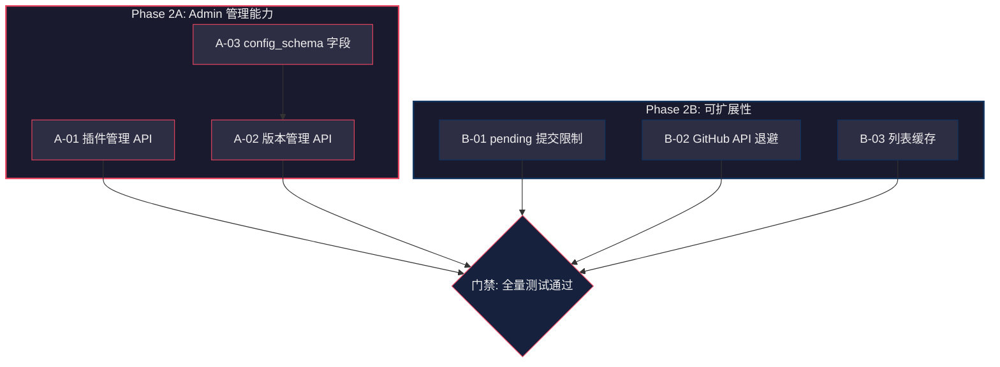

# 下一阶段：Admin 能力补齐 & 可扩展性增强

> **版本**: v3 — Phase 0（安全加固）+ Phase 1（基础设施）已全部完成  
> **创建日期**: 2026-03-06  
> **适用仓库**: sub2api-plugin-market (控制平面)

---

## 一、已完成回顾

| 阶段 | 完成项 | 测试数 |
|------|--------|--------|
| v1 代码质量 | 17 项（路由/日志/查询/同步/仓储/测试等） | 71 |
| Phase 0 安全加固 | 8 项（速率限制/webhook/事务/正则/角色/锁/清理/乐观锁） | 88 |
| Phase 1 基础设施 | 6 项（plugin_type/capabilities/compatible_with/自动发布/签名链路/文档） | 95 |

---

## 二、本轮目标

```
Phase 2A — Admin 管理能力补齐       让管理后台可以完整管理插件和版本
Phase 2B — 数据完整性 & 可扩展性    限制并发提交、缓存热点查询、GitHub API 保护
```

---

## 三、Phase 2A — Admin 管理能力补齐

### A-01 Admin 插件列表与管理 API

| 项目 | 内容 |
|------|------|
| **文件** | 新增 `internal/admin/handler/plugin_handler.go`、修改 `internal/admin/router.go` |
| **问题** | 管理后台无法查看/搜索/管理插件，只能通过审核间接操作 |
| **修复方案** | 新增 Admin 插件 API：列表（含全状态）、详情、更新状态（active/deprecated/suspended） |

**新增端点：**
- `GET /admin/api/plugins` — 插件列表（支持全部状态，含 suspended/deprecated）
- `GET /admin/api/plugins/:id` — 插件详情（含版本列表）
- `PUT /admin/api/plugins/:id` — 更新插件字段（display_name/category/is_official/status/plugin_type）

---

### A-02 Admin 版本管理 API

| 项目 | 内容 |
|------|------|
| **文件** | 新增 `internal/admin/handler/version_handler.go`、修改 `internal/admin/router.go` |
| **问题** | 管理后台无法管理插件版本（查看 draft/yank 版本等） |
| **修复方案** | 新增版本管理 API：列表（含全状态）、详情、状态变更（draft→published、published→yanked） |

**新增端点：**
- `GET /admin/api/plugins/:id/versions` — 版本列表（含全状态 draft/published/yanked）
- `PUT /admin/api/plugins/:id/versions/:vid/status` — 变更状态（publish/yank）

---

### A-03 PluginVersion 增加 `config_schema` 字段

| 项目 | 内容 |
|------|------|
| **文件** | `ent/schema/plugin_version.go` + `make generate` |
| **问题** | 插件无法声明配置模板，sub2api 安装时无法生成配置表单 |
| **修复方案** | 新增 `field.JSON("config_schema", map[string]interface{}{}).Optional()` |

---

## 四、Phase 2B — 数据完整性 & 可扩展性

### B-01 限制每插件并发 pending Submission

| 项目 | 内容 |
|------|------|
| **文件** | `internal/service/submission_service.go` |
| **问题** | 同一插件可无限提交 pending Submission，造成审核积压 |
| **修复方案** | `CreateSubmission` 中检查：同一 `plugin_id` 下 pending 数量 ≥ 3 时拒绝新提交 |

---

### B-02 GitHub API 指数退避

| 项目 | 内容 |
|------|------|
| **文件** | `internal/service/sync_service.go` |
| **问题** | GitHub API 请求无速率限制保护，批量同步时可能触发 403 |
| **修复方案** | 读取 `X-RateLimit-Remaining` 响应头，剩余 < 10 时休眠至 `X-RateLimit-Reset`；HTTP 429 自动指数退避重试（最多 3 次） |

---

### B-03 插件列表内存缓存

| 项目 | 内容 |
|------|------|
| **文件** | `internal/service/plugin_service.go` |
| **问题** | 每次列表请求直接查库，1000+ 插件时压力大 |
| **修复方案** | 实现 TTL 内存缓存（1 分钟），key 为查询参数组合的哈希，写入操作（创建/更新插件）时清除缓存 |

---

## 五、实施执行清单

> **规则**：逐项执行，完成后在 `[ ]` 中打 `x`，填入实际完成日期。

### Phase 2A: Admin 管理能力补齐

- [ ] **A-01** Admin 插件列表与管理 API
  - 完成日期：____
  - 验证：`GET /admin/api/plugins` 返回含 suspended 插件
- [ ] **A-02** Admin 版本管理 API
  - 完成日期：____
  - 验证：`PUT /admin/api/plugins/:id/versions/:vid/status` 可 yank 版本
- [ ] **A-03** PluginVersion 增加 `config_schema` 字段
  - 完成日期：____
  - 验证：创建版本可设置 config_schema
- [ ] **门禁** `go build` + `go test -short ./...` 全量通过

### Phase 2B: 数据完整性 & 可扩展性

- [ ] **B-01** 限制每插件并发 pending Submission（≥ 3 拒绝）
  - 完成日期：____
  - 验证：同一插件第 4 次 pending 提交被拒绝
- [ ] **B-02** GitHub API 指数退避
  - 完成日期：____
  - 验证：模拟 429 响应时自动重试
- [ ] **B-03** 插件列表内存缓存（1 分钟 TTL）
  - 完成日期：____
  - 验证：相同查询 1 分钟内不重复查库
- [ ] **门禁** `go build` + `go test -short ./...` 全量通过

---

## 六、依赖关系图


