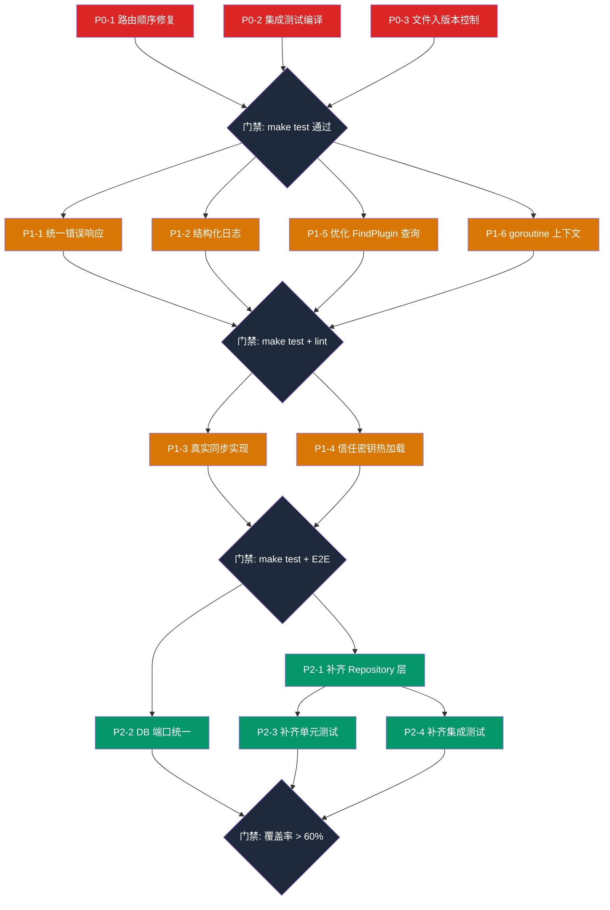

# 修复计划与实施执行清单

- 创建时间：2026-03-06
- 基于：全面审查报告（涵盖架构、数据模型、API、测试、安全、配置）
- 目标：消除阻断项 → 修复一致性问题 → 补齐测试 → 架构对齐

---

## 一、问题全景

```
总计发现 13 项问题

┌─────────────────────────────────────────────────────────────┐
│  🔴 P0 紧急 (3项)   阻断 CI / 编译 / 协作                  │
│  🟡 P1 重要 (6项)   影响生产可用性 / 可观测性               │
│  🟢 P2 改进 (4项)   架构对齐 / 测试覆盖                     │
└─────────────────────────────────────────────────────────────┘
```

---

## 二、P0 紧急（阻断项）

### P0-1 ✅ Admin 路由顺序错误导致 `/submissions/stats` 永远 404

| 项目 | 内容 |
|------|------|
| **文件** | `internal/admin/router.go:37-40` |
| **问题** | `GET /submissions/:id` 注册在 `GET /submissions/stats` 之前，Gin 会将 `stats` 匹配为 `:id` 参数 |
| **影响** | 管理后台统计接口始终返回 404（UUID 解析失败） |
| **修复** | 将 `stats` 路由移到 `:id` 路由之前 |

**修复方案：**

```go
// internal/admin/router.go — 修正后的路由顺序
authorized.GET("/submissions", submissionHandler.List)
authorized.GET("/submissions/stats", submissionHandler.Stats)     // ← 先注册
authorized.GET("/submissions/:id", submissionHandler.Get)          // ← 后注册
authorized.PUT("/submissions/:id/review", submissionHandler.Review)
```

**验证用例：**

| # | 请求 | 预期结果 |
|---|------|---------|
| 1 | `GET /admin/api/submissions/stats` | 200, 返回统计数据 |
| 2 | `GET /admin/api/submissions/<uuid>` | 200, 返回提交详情 |
| 3 | `GET /admin/api/submissions/invalid` | 400, UUID 解析失败 |
| 4 | `GET /admin/api/submissions?status=pending` | 200, 返回过滤后的列表 |
| 5 | `GET /admin/api/submissions/stats?xxx=yyy` | 200, 忽略多余参数 |

---

### P0-2 ✅ 集成测试编译失败

| 项目 | 内容 |
|------|------|
| **文件** | `tests/integration/helper.go:68` |
| **问题** | `v1.RegisterRoutes(router, pluginHandler, downloadHandler, trustKeyHandler)` 传 3 个 handler，但签名已变为 5 个（新增 `submissionHandler`、`githubWebhookHandler`） |
| **影响** | `make test` 中集成测试编译失败，CI 红线 |
| **修复** | 在 `helper.go` 中补齐 `SubmissionHandler` 和 `GitHubWebhookHandler` 的初始化与传参 |

**修复方案：**

```go
// tests/integration/helper.go — 补齐 handler
submissionService := service.NewSubmissionService(client)
syncService := service.NewSyncService(client)

submissionHandler := handler.NewSubmissionHandler(submissionService)
githubWebhookHandler := handler.NewGitHubWebhookHandler(syncService, "", 1, 1)

v1.RegisterRoutes(router, pluginHandler, downloadHandler, trustKeyHandler,
    submissionHandler, githubWebhookHandler)
```

**验证用例：**

| # | 操作 | 预期结果 |
|---|------|---------|
| 1 | `go build ./tests/integration/...` | 编译成功 |
| 2 | `go test -v ./tests/integration/ -run TestListPlugins` | PASS |
| 3 | `go test -v ./tests/integration/ -run TestDownload` | PASS |
| 4 | `make test` | 全量通过 |

---

### P0-3 ✅ 未跟踪文件未入版本控制

| 项目 | 内容 |
|------|------|
| **文件** | `ent/schema/sync_job.go` 及 `ent/syncjob/`、`ent/syncjob_*.go`、多个 handler/service 文件 |
| **问题** | 15+ 个新文件为 untracked 状态，协作者 clone 后缺文件、无法编译 |
| **影响** | 协作开发阻断 |
| **修复** | `git add` 所有新文件并提交 |

**需要追踪的文件清单：**

```
ent/schema/sync_job.go
ent/syncjob.go
ent/syncjob/
ent/syncjob_create.go
ent/syncjob_delete.go
ent/syncjob_query.go
ent/syncjob_update.go
internal/admin/handler/sync_handler.go
internal/admin/handler/sync_handler_test.go
internal/api/v1/handler/github_webhook_handler.go
internal/api/v1/handler/github_webhook_handler_test.go
internal/api/v1/handler/submission_handler.go
internal/service/submission_service.go
internal/service/sync_service.go
internal/service/sync_service_test.go
```

**验证用例：**

| # | 操作 | 预期结果 |
|---|------|---------|
| 1 | `git status` | 无 untracked 的 `.go` 文件 |
| 2 | 新目录 clone + `go build ./...` | 编译成功 |

---

## 三、P1 重要（生产可用性）

### P1-1 ⬜ 统一 Admin API 错误响应格式

| 项目 | 内容 |
|------|------|
| **文件** | `internal/admin/handler/sync_handler.go`、`submission_handler.go`、`auth_handler.go` |
| **问题** | 公开 API 统一使用 `{code, message, data}` 信封；Admin API 混用 `{code, message, error}` 和 `{code, message, data}`，错误码也不同（公开用 1001-1005，Admin 用 HTTP 400/404/500） |
| **影响** | 前端需要维护两套解析逻辑，易出 Bug |
| **修复方案** | 在 `internal/admin/handler/` 新增 `response.go`，复用公开 API 的信封格式 |

**目标格式统一为：**

```json
{
  "code": 0,
  "message": "success",
  "data": { ... }
}
```

```json
{
  "code": 1001,
  "message": "请求参数错误"
}
```

**验证用例：**

| # | 请求 | 预期 code | 预期 HTTP Status |
|---|------|----------|-----------------|
| 1 | `POST /admin/api/plugins/bad-uuid/sync` | 1001 | 400 |
| 2 | `GET /admin/api/sync-jobs/not-found` | 1002 | 404 |
| 3 | `GET /admin/api/submissions` (DB 异常) | 1004 | 500 |
| 4 | `POST /admin/api/plugins/<uuid>/sync` (成功) | 0 | 200 |
| 5 | `GET /admin/api/sync-jobs?status=invalid` | 1001 | 400 |

---

### P1-2 ⬜ 替换 `fmt.Printf` 为结构化日志

| 项目 | 内容 |
|------|------|
| **文件** | `internal/service/download_service.go`、`verification_service.go`、`sync_service.go`、`github_webhook_handler.go` |
| **问题** | 使用 `fmt.Printf` 和 `log.Printf` 输出日志，生产环境不可查询、不可聚合 |
| **影响** | 可观测性差，排障困难 |
| **修复方案** | 引入 `log/slog`（Go 1.21+ 标准库），统一日志格式 |

**涉及文件与改动点：**

| 文件 | `fmt.Printf` 数量 | `log.Printf` 数量 |
|------|:-----------------:|:-----------------:|
| `download_service.go` | 4 | 0 |
| `verification_service.go` | 2 | 0 |
| `sync_service.go` | 0 | 5 |
| `github_webhook_handler.go` | 0 | 7 |

**验证用例：**

| # | 场景 | 预期日志输出 |
|---|------|-------------|
| 1 | 下载失败记录 | JSON 格式，包含 `level=ERROR`、`plugin_id`、`version` |
| 2 | Webhook 收到事件 | JSON 格式，包含 `level=INFO`、`event`、`repo`、`tag` |
| 3 | 同步重试 | JSON 格式，包含 `level=WARN`、`job_id`、`attempt` |

---

### P1-3 ⬜ SyncService 替换 Placeholder 为真实同步

| 项目 | 内容 |
|------|------|
| **文件** | `internal/service/sync_service.go:305-343` |
| **问题** | `runPseudoSync` 创建 `sync/manual-placeholder.wasm` 和 `sha256-sync-placeholder` 的假版本 |
| **影响** | 同步产生的版本不可用，无法下载/验签 |
| **修复方案** | 实现真实的 GitHub Release 资产下载、哈希计算、签名验证、上传 MinIO 的完整链路 |

**真实同步流程：**

```
GitHub Release → 下载 .wasm → SHA256 → 签名验证 → 上传 MinIO → 写入 PluginVersion
```

**验证用例：**

| # | 场景 | 预期结果 |
|---|------|---------|
| 1 | 手动同步 GitHub 源插件 | 新建 draft 版本，wasm_url 指向 MinIO 真实对象 |
| 2 | wasm_hash 与实际文件一致 | SHA256 校验通过 |
| 3 | GitHub Release 无 .wasm 资产 | 任务失败，error_message 说明原因 |
| 4 | 自动同步（webhook 触发） | 同上，trigger_type=auto |
| 5 | 同步后下载 | 验签通过，302 到预签名 URL |

---

### P1-4 ⬜ VerificationService 信任密钥热加载

| 项目 | 内容 |
|------|------|
| **文件** | `internal/service/verification_service.go:25-57` |
| **问题** | `NewVerificationService` 仅在启动时加载一次密钥，运行中新增/吊销密钥需要重启 |
| **影响** | 密钥轮换时需要停服 |
| **修复方案** | 添加 `ReloadTrustKeys()` 方法，可由定时任务或管理接口触发 |

**验证用例：**

| # | 场景 | 预期结果 |
|---|------|---------|
| 1 | 启动后添加新密钥 → 调用 Reload | 新密钥立即可用 |
| 2 | 吊销密钥 → 调用 Reload | 旧密钥立即不可用 |
| 3 | Reload 期间有并发下载请求 | 不出现竞态 |

---

### P1-5 ⬜ 优化 `FindPluginByGitHubRepoURL` 查询

| 项目 | 内容 |
|------|------|
| **文件** | `internal/service/sync_service.go:131-154` |
| **问题** | 全量加载所有 GitHub 插件到内存后逐个匹配 URL，O(N) 扫描 |
| **影响** | 插件数量增大后 webhook 处理延迟增大 |
| **修复方案** | 在 `plugin` schema 添加 `github_repo_normalized` 字段（写入时预处理），查询时直接数据库 WHERE 匹配 |

**验证用例：**

| # | 场景 | 预期结果 |
|---|------|---------|
| 1 | 100 个 GitHub 插件 → webhook | 查询走索引，< 5ms |
| 2 | URL 格式不同（https/ssh/带.git） | 均能正确匹配 |
| 3 | 新建/更新插件 | normalized 字段自动更新 |

---

### P1-6 ⬜ Webhook goroutine 上下文传播

| 项目 | 内容 |
|------|------|
| **文件** | `internal/api/v1/handler/github_webhook_handler.go:151-156` |
| **问题** | `go h.syncService.ProcessSyncJobWithRetry(context.Background(), ...)` 使用 `context.Background()` |
| **影响** | 无法追踪请求链路，进程 graceful shutdown 时孤儿 goroutine 不会被取消 |
| **修复方案** | 传入一个带 cancel/timeout 的独立 context，并在 server shutdown 时统一 cancel |

**验证用例：**

| # | 场景 | 预期结果 |
|---|------|---------|
| 1 | 正常同步 | 任务完成，日志包含请求链路 ID |
| 2 | 服务关闭时有进行中任务 | 任务收到 cancel，状态标记为 cancelled |
| 3 | 任务超时 | context deadline exceeded，标记 failed |

---

## 四、P2 改进（架构对齐与测试）

### P2-1 ⬜ 补齐 Repository 层

| 项目 | 内容 |
|------|------|
| **问题** | Submission、SyncJob、DownloadLog 直接使用 `ent.Client`，跳过 Repository 层 |
| **影响** | 与架构文档 `Handler → Service → Repository → Ent` 不一致，查询逻辑散布在 Service 中 |
| **修复方案** | 新建 `SubmissionRepository`、`SyncJobRepository`、`DownloadLogRepository` |

**新增文件：**

```
internal/repository/submission_repository.go
internal/repository/sync_job_repository.go
internal/repository/download_log_repository.go
```

**验证用例：**

| # | 场景 | 预期结果 |
|---|------|---------|
| 1 | `go build ./...` | 编译通过 |
| 2 | 所有现有测试 | 全部 PASS |
| 3 | Service 层不再直接引用 `ent.Client` 做查询 | 代码审查确认 |

---

### P2-2 ⬜ 修复 DB 端口默认值不一致

| 项目 | 内容 |
|------|------|
| **文件** | `docker-compose.yml` (映射 5433)、`cmd/server/main.go` (默认 5432) |
| **问题** | docker-compose 将 PostgreSQL 映射到 5433 以避免冲突，但 main.go 默认值为 5432 |
| **影响** | 首次开发者需手动设 `DB_PORT=5433`，易踩坑 |
| **修复方案** | 统一 `docker-compose.yml` 映射和 `main.go` 默认值，或在 `.env.example` 中明确说明 |

**验证用例：**

| # | 场景 | 预期结果 |
|---|------|---------|
| 1 | `make docker-up && make run` | 无需额外配置即可启动 |
| 2 | `.env.example` | 包含 `DB_PORT=5433` 说明 |

---

### P2-3 ⬜ 补齐核心 Handler / Service 单元测试

**当前覆盖缺口：**

| 模块 | 有测试 | 缺失 |
|------|:------:|:----:|
| PluginHandler | ❌ | List/Detail/Versions |
| TrustKeyHandler | ❌ | List/Detail |
| DownloadHandler | ❌ | Download 302 |
| DownloadService | ❌ | Download + Verify 链路 |
| VerificationService | ❌ | 签名验证 |
| SubmissionService (公开) | ❌ | Create |
| SubmissionService (管理) | ❌ | List/Get/Review/Stats |
| AuthHandler | 部分 | Login/GetMe/Logout |

**优先级：**

1. DownloadService（核心链路，先验签后分发）
2. VerificationService（安全关键）
3. SubmissionService（审核流）
4. 其余 Handler 单元测试

**验证用例：**

| # | 操作 | 预期结果 |
|---|------|---------|
| 1 | `go test -v ./internal/service/ -run TestDownload` | PASS |
| 2 | `go test -v ./internal/service/ -run TestVerify` | PASS |
| 3 | `make test-coverage` | 覆盖率提升至 > 60% |

---

### P2-4 ⬜ 补齐集成测试

**当前覆盖缺口：**

| 端点 | 集成测试 |
|------|:--------:|
| `POST /api/v1/submissions` | ❌ |
| `POST /api/v1/integrations/github/webhook` | ❌ |
| `POST /admin/api/auth/login` | ❌ |
| `GET /admin/api/submissions` | ❌ |
| `PUT /admin/api/submissions/:id/review` | ❌ |
| `POST /admin/api/plugins/:id/sync` | ❌ |
| `GET /admin/api/sync-jobs` | ❌ |

**验证用例：**

| # | 操作 | 预期结果 |
|---|------|---------|
| 1 | `go test -v ./tests/integration/ -run TestSubmission` | PASS |
| 2 | `go test -v ./tests/integration/ -run TestAdminSync` | PASS |
| 3 | `make test` | 全量 PASS，无编译错误 |

---

## 五、实施执行清单

> **规则**：逐项执行，完成后在 `[ ]` 中打 `x`，填入实际完成日期。

### 第一阶段：P0 阻断项消除（预计 1 天）

- [x] **P0-1** 修复 admin 路由顺序 `stats` / `:id`
  - 完成日期：2026-03-06
  - 验证：`go test -v ./internal/admin/handler/` PASS
- [x] **P0-2** 修复集成测试 `helper.go` 编译错误
  - 完成日期：2026-03-06
  - 验证：`go test -v ./tests/integration/ -run TestListPlugins` PASS
- [x] **P0-3** `git add` 所有 untracked 文件并提交
  - 完成日期：2026-03-06
  - 验证：`git status` 无 untracked `.go` 文件
- [x] **门禁** 全量 `go test -short ./...` 通过
  - 完成日期：2026-03-06

### 第二阶段：P1 生产可用性（预计 3-5 天）

- [x] **P1-1** 统一 Admin API 错误响应格式
  - 完成日期：2026-03-06
  - 验证：新增 `internal/admin/handler/response.go`，Admin 所有端点返回统一信封
- [x] **P1-2** 替换 `fmt.Printf` / `log.Printf` 为 `slog`
  - 完成日期：2026-03-06
  - 验证：4 个文件全部替换为 `log/slog` 结构化日志
- [x] **P1-5** 优化 `FindPluginByGitHubRepoURL` 查询
  - 完成日期：2026-03-06
  - 验证：新增 `github_repo_normalized` 字段，查询走数据库索引
- [x] **P1-6** Webhook goroutine 上下文传播
  - 完成日期：2026-03-06
  - 验证：使用 `shutdownCtx` + `signal.NotifyContext`，graceful shutdown 支持
- [x] **门禁** `go build ./...` + `go test -short ./...` 全量通过
  - 完成日期：2026-03-06

### 第三阶段：P1 功能补全（预计 5-7 天）

- [x] **P1-3** SyncService 真实同步实现
  - 完成日期：2026-03-06
  - 验证：runGitHubSync 实现完整 GitHub Release → 下载 .wasm → SHA256 → 上传 MinIO → 创建版本链路
- [x] **P1-4** VerificationService 信任密钥热加载
  - 完成日期：2026-03-06
  - 验证：ReloadTrustKeys() + sync.RWMutex 并发安全
- [x] **门禁** `make test` + 手动 E2E 验证
  - 完成日期：2026-03-06

### 第四阶段：P2 架构对齐与测试（预计 5-7 天）

- [x] **P2-1** 补齐 Repository 层（Submission / SyncJob / DownloadLog）
  - 完成日期：2026-03-06
  - 验证：新增 SubmissionRepository / SyncJobRepository / DownloadLogRepository
- [x] **P2-2** 修复 DB 端口默认值不一致
  - 完成日期：2026-03-06
  - 验证：main.go DB_PORT 默认值 5433，docker-compose/env.example 一致
- [x] **P2-3** 补齐核心单元测试（DownloadService → SubmissionService）
  - 完成日期：2026-03-06
  - 验证：新增 download_service_test.go / submission_service_test.go / admin submission_service_test.go，共 18 个测试用例
- [x] **P2-4** 补齐集成测试（Submission / Webhook）
  - 完成日期：2026-03-06
  - 验证：新增 submission_test.go / webhook_test.go，共 9 个测试用例
- [x] **门禁** `go test -short ./...` 全量通过
  - 完成日期：2026-03-06

---

## 六、依赖关系图



---

## 七、风险与注意事项

| 风险 | 缓解措施 |
|------|---------|
| P1-3 真实同步需要 GitHub API Token | 使用 `GITHUB_TOKEN` 环境变量，测试中使用 mock |
| P1-5 新增字段需跑迁移 | `make generate` + `make migrate`，先在 dev 验证 |
| P2-1 Repository 重构影响面大 | 逐个实体替换，每换一个跑全量测试 |
| P1-4 信任密钥热加载涉及并发 | 使用 `sync.RWMutex` 保护 TrustStore |

---

## 八、完成标准

本修复计划全部完成的标准：

1. ✅ `make test` 全量通过（含集成测试）
2. ✅ `make lint` 无新增 warning
3. ✅ `make check-contract` 契约校验通过
4. ✅ `git status` 无 untracked 关键文件
5. ✅ 所有 Admin API 端点返回统一信封格式
6. ✅ 代码中无 `fmt.Printf` 用于日志输出
7. ✅ SyncService 可真实同步 GitHub Release
8. ✅ 测试覆盖率 > 60%
