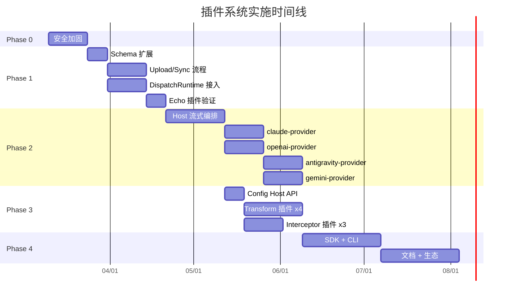

# 插件系统完整实施方案

> **文档状态**: V2 — 可执行（含源码交叉校验修正）  
> **创建日期**: 2026-03-06  
> **适用仓库**: sub2api (数据平面) + sub2api-plugin-market (控制平面)  
> **前置文档**: 本方案基于 00~05 系列文档的全部发现制定

---

## 一、现状诊断

### 1.1 一句话结论

> **架构设计合理，实现完成度不足。12 个候选插件中 0 个能走通「发布→安装→执行」全链路。**

### 1.2 现状全景

```
                     ┌────────────────────────────────────────────────────────┐
                     │                 插件市场 (控制平面)                       │
                     │                                                        │
                     │   Upload 路径:                                         │
                     │     POST /submissions ──→ 创建 Plugin + Submission      │
                     │     审核通过 ──→ 更新 Plugin 元数据                      │
                     │     ❌ 不创建 PluginVersion                             │
                     │     ❌ 不上传 WASM                                      │
                     │     ❌ 不提交签名                                        │
                     │                                                        │
                     │   GitHub Sync 路径:                                     │
                     │     Webhook ──→ 下载 WASM ──→ 上传存储 ──→ 创建 Version │
                     │     ⚠️ status=draft, signature=空                       │
                     │     ❌ 无 draft→published 流程                           │
                     │     ❌ 无签名环节                                        │
                     │                                                        │
                     │   下载链路: ✅ 验签 + 预签名 URL (但没有可用的版本来源)    │
                     └──────────────────────────┬─────────────────────────────┘
                                                │
                                                │ REST API
                                                ▼
                     ┌────────────────────────────────────────────────────────┐
                     │                  sub2api (数据平面)                      │
                     │                                                        │
                     │   gateway_handler.go:                                  │
                     │     ❌ 硬编码 switch platform → 直接调各 Service          │
                     │     ❌ 未调用 DispatchRuntime.Dispatch()                 │
                     │                                                        │
                     │   DispatchRuntime:                                     │
                     │     ✅ 调度逻辑完整 (Interceptor→Transform→Provider)     │
                     │     ❌ 未接入主请求链路                                   │
                     │     ⚠️ Interceptor next 链为空实现                       │
                     │                                                        │
                     │   Host API:                                            │
                     │     ✅ HTTP (仅完整 body) / KV / Log                    │
                     │     ❌ HTTP 无流式 Fetch                                 │
                     │     ❌ 无 Config Host API                                │
                     │     ❌ StreamWriter 缺 Flush/Done                       │
                     │                                                        │
                     │   生命周期:                                             │
                     │     ✅ 控制面客户端 + Lockfile + 依赖解析                 │
                     │     ❌ 热重载未实现                                       │
                     └────────────────────────────────────────────────────────┘
```

### 1.3 核心阻断点（按严重度排序）

| # | 阻断点 | 影响 | 归属 |
|---|--------|------|------|
| B1 | **无 WASM 上传/签名/发布流程** | Upload 路径完全不可用 | 市场 |
| B2 | **Sync 创建 draft + 无签名 → 无法下载** | GitHub 路径断裂 | 市场 |
| B3 | **DispatchRuntime 未接入 gateway_handler** | 插件无法执行 | 主项目 |
| B4 | **Host API HTTP 无流式** | 4 个 Provider 无法做 SSE | 主项目 |
| B5 | **Plugin Schema 缺 plugin_type** | 无法区分插件类型 | 市场 |
| B6 | **无 Config Host API** | model-mapper 无法读取映射表 | 主项目 |
| B7 | **Interceptor next 链为空** | 包装型 Interceptor 不工作 | 主项目 |
| B8 | **安全漏洞 (提交无认证/Webhook 可跳过)** | 生产不可用 | 市场 |

---

## 二、目标架构

### 2.1 端到端目标

```
开发者                      插件市场                         sub2api
  │                           │                               │
  ├─ 开发插件 (SDK)           │                               │
  ├─ TinyGo 编译 WASM        │                               │
  ├─ Ed25519 签名 (CLI)      │                               │
  │                           │                               │
  ├─ POST /submissions ──────→ 创建 Submission               │
  │   (含 WASM + manifest     │   + PluginVersion (draft)     │
  │    + signature)            │   + 上传 WASM 到存储          │
  │                           │                               │
  │                  管理员 ──→ PUT /review (approve)          │
  │                           │   → 验签                      │
  │                           │   → PluginVersion → published  │
  │                           │   → Submission → approved       │
  │                           │                               │
  │                           │←── GET /plugins?type=provider ─┤
  │                           │←── GET /versions?compat=1.2 ──┤
  │                           │←── GET /download ──────────────┤
  │                           │    → 验签 + 预签名 URL         │
  │                           │                               │
  │                           │                    安装 + 验签 ─┤
  │                           │                    加载 WASM   ─┤
  │                           │                    注册到       ─┤
  │                           │                    DispatchRT   │
  │                           │                               │
  │                           │              请求到达 ──────────┤
  │                           │                 │              │
  │                           │                 ▼              │
  │                           │     核心: 认证/计费/并发/选号   │
  │                           │                 │              │
  │                           │                 ▼              │
  │                           │     DispatchRuntime.Dispatch() │
  │                           │       Interceptor → Transform  │
  │                           │       → Provider → Transform   │
  │                           │                 │              │
  │                           │                 ▼              │
  │                           │     核心: 用量记录/扣费         │
  │                           │                 │              │
  │                           │                 ▼              │
  │                           │              返回响应           │
```

### 2.2 GitHub Sync 目标

```
GitHub Release (含签名的 .wasm)
    │
    ▼  Webhook
市场: 下载 WASM + manifest.json + signature
    │
    ├─ 解析 manifest (plugin_type, capabilities, min/max_api_version)
    ├─ 验证签名 (Ed25519)
    ├─ 上传 WASM 到存储
    ├─ 创建 PluginVersion (status=published, 含签名信息)
    │
    ▼
sub2api 可直接下载
```

### 2.3 Provider 流式架构

```
                    核心 (Go 原生)                              WASM 插件
                         │                                        │
               1. 选号 + GetToken                                │
                         │                                        │
               2. 注入 ProviderContext                            │
                   到 GatewayRequest.Metadata                     │
                         │                                        │
               3. 调用 plugin.Handle(req)  ───────────────────→   │
                         │                                     4. 构建上游请求
                         │                                        (URL, Headers, Body)
                         │                                        │
                         │                                     5. 返回 StreamDelegate
                         │                                        {URL, Headers, Method}
               6. ←──────────────────────────────────────────     │
                         │                                        │
          [非流式]    7a. Host 发 HTTP → 完整 Body                │
                         │                                        │
                      8a. 回调 plugin.OnResponse(body) ──────→    │
                         │                                     9a. 解析 JSON
                         │                                        提取 Usage
                      ←──────────────────────── 返回 Response     │
                         │                                        │
          [流式]      7b. Host 发 HTTP (goroutine + channel)      │
                         │                                        │
                      8b. 每行回调 plugin.OnSSELine(line) ───→    │
                         │                                     9b. 转换 SSE 行
                         │                                        提取 Usage
                      ←──────────────────────── 返回转换后的行     │
                         │                                        │
                      10b. Host → StreamWriter.WriteChunk         │
                           StreamWriter.Flush                     │
                         │                                        │
              11. 收到 ProviderResultMetadata                     │
                   → rateLimitService                             │
                   → Usage 计费                                   │
                   → Ops 记录                                     │
```

---

## 三、完整任务分解

### Phase 0: 安全加固 (1-2 周)

> 目标: 修复生产环境不可接受的安全和数据完整性问题

#### 0.1 市场端安全修复

| # | 任务 | 涉及仓库 | 涉及文件 | 具体改动 | 工作量 |
|---|------|---------|---------|---------|--------|
| 0.1.1 | 提交 API 限流 | market | `api/v1/router.go` | 新增 IP 级 rate limit middleware (如 `golang.org/x/time/rate`), 限制 POST /submissions 每 IP 10次/分 | 小 |
| 0.1.2 | Webhook 签名强制 | market | `api/v1/handler/github_webhook_handler.go` | `if h.secret == ""` 时返回 500 并记录错误, 不处理 webhook | 小 |
| 0.1.3 | 审核事务化 | market | `admin/service/submission_service.go` | `ReviewSubmission` 方法用 `client.Tx()` 包裹 Submission 更新 + Plugin 更新 | 小 |
| 0.1.4 | 插件名正则校验 | market | `ent/schema/plugin.go` | `field.String("name").Match(regexp.MustCompile("^[a-z0-9][a-z0-9-]{0,62}$"))` | 小 |
| 0.1.5 | 审核角色限制 | market | `admin/handler/submission_handler.go` | 审核时检查: 若 plugin.IsOfficial, 则 admin_user.role 必须为 super_admin 或 admin | 小 |
| 0.1.6 | Sync 并发锁 | market | `service/sync_service.go` | 用 Redis SETNX 或 PostgreSQL advisory lock, key=`sync:{plugin_id}:{ref}`, TTL=10min | 中 |
| 0.1.7 | Sync 操作顺序 | market | `service/sync_service.go` | 调整为: 检查版本是否存在 → 上传 WASM → 创建 PluginVersion; 创建失败则删除已上传 WASM | 小 |
| 0.1.8 | 审核乐观锁 | market | `admin/service/submission_service.go` | `UpdateOne().Where(submission.StatusEQ(submission.StatusPending))`, 更新 0 行则返回 conflict | 小 |

#### 0.2 验收

```
测试用例:
1. 同一 IP 连续提交 15 次 → 第 11 次起返回 429
2. 不配置 GITHUB_WEBHOOK_SECRET → webhook 返回 500
3. 插件名 "../hack" → 创建失败, 返回 400
4. 两个管理员同时审核同一 Submission → 后者返回 409
5. 同时触发手动 Sync 和 Webhook Sync → 只有一个执行, 另一个等待
6. Sync 创建版本失败 → 已上传的 WASM 被清理
```

---

### Phase 1: 链路打通 (3-4 周)

> 目标: 实现插件的完整发布链路 + DispatchRuntime 接入主请求路径 + 一个 Echo 插件跑通全链路

#### 1.1 市场端: Schema 扩展

| # | 任务 | 涉及文件 | 具体改动 |
|---|------|---------|---------|
| 1.1.1 | Plugin 加 plugin_type | `ent/schema/plugin.go` | `field.Enum("plugin_type").Values("interceptor", "transform", "provider").Optional()` |
| 1.1.2 | PluginVersion 加 capabilities | `ent/schema/plugin_version.go` | `field.JSON("capabilities", []string{}).Optional()` |
| 1.1.3 | PluginVersion 加 config_schema | `ent/schema/plugin_version.go` | `field.JSON("config_schema", map[string]any{}).Optional()` |
| 1.1.4 | make generate | 全部 ent 生成文件 | `make generate && go mod tidy` |

#### 1.2 市场端: WASM 上传 + 签名 + 发布流程

这是**最关键的缺失能力**。需要实现两条完整路径:

**路径 A: 手动上传**

```
POST /api/v1/submissions (multipart/form-data)
    ├─ wasm_file: 二进制 WASM
    ├─ manifest: JSON (name, version, plugin_type, capabilities, min/max_api_version)
    ├─ signature: base64 Ed25519 签名
    ├─ sign_key_id: 签名密钥 ID
    ├─ plugin_name, description, author, ...
    │
    ▼ service 层:
    1. 验证 manifest 格式
    2. 计算 WASM SHA-256
    3. 验证签名 (pluginsign.VerifySignature)
    4. 上传 WASM 到存储
    5. 创建/更新 Plugin (含 plugin_type)
    6. 创建 PluginVersion (status=draft, 含 wasm_url, wasm_hash, signature, sign_key_id)
    7. 创建 Submission (关联 plugin_version_id)
    │
    ▼ 管理员审核:
    PUT /admin/api/submissions/:id/review
    {action: "approved"}
    │
    ▼ service 层 (事务内):
    1. 更新 Submission → approved
    2. 更新 PluginVersion → published, set published_at
    3. 更新 Plugin 元数据
```

| # | 任务 | 涉及文件 | 工作量 |
|---|------|---------|--------|
| 1.2.1 | Submission Schema 加 version 关联 | `ent/schema/submission.go` | 小 |
| 1.2.2 | 提交 handler 支持 multipart | `api/v1/handler/submission_handler.go` | 中 |
| 1.2.3 | submission_service 实现完整创建流程 | `service/submission_service.go` | 中 |
| 1.2.4 | 审核 service 联动发布版本 | `admin/service/submission_service.go` | 中 |
| 1.2.5 | 新增 WASM 上传 + 签名验证 | `service/submission_service.go` | 中 |

**路径 B: GitHub Sync 自动发布**

```
GitHub Release (要求 assets 中包含):
    ├─ plugin.wasm
    ├─ manifest.json
    └─ signature.sig (Ed25519 签名)
    │
    ▼ SyncJob:
    1. 下载 plugin.wasm + manifest.json + signature.sig
    2. 解析 manifest → 提取 plugin_type, capabilities, min/max_api_version
    3. 计算 WASM SHA-256
    4. 验证签名
    5. 上传 WASM 到存储
    6. 创建 PluginVersion (status=published, 含完整签名信息)
```

| # | 任务 | 涉及文件 | 工作量 |
|---|------|---------|--------|
| 1.2.6 | Sync 下载 manifest + signature | `service/sync_service.go` | 中 |
| 1.2.7 | Sync 解析 manifest 填充字段 | `service/sync_service.go` | 小 |
| 1.2.8 | Sync 验签后直接创建 published 版本 | `service/sync_service.go` | 中 |

#### 1.3 市场端: API 增强

| # | 任务 | 涉及文件 | 工作量 |
|---|------|---------|--------|
| 1.3.1 | GET /plugins 支持 ?type= | `repository/`, `handler/` | 小 |
| 1.3.2 | GET /versions 支持 ?compatible_with= | `repository/`, `handler/` | 中 |
| 1.3.3 | OpenAPI spec 同步 | `openapi/plugin-market-v1.yaml` | 小 |
| 1.3.4 | ERROR-CODE-REGISTRY 同步 | `docs/ERROR-CODE-REGISTRY.md` | 小 |

#### 1.4 主项目: DispatchRuntime 接入

| # | 任务 | 涉及文件 | 具体改动 | 工作量 |
|---|------|---------|---------|--------|
| 1.4.1 | DispatchRuntime 接入 gateway_handler | `handler/gateway_handler.go` | 在认证/计费/并发/选号之后, switch platform 之前, 调用 `DispatchRuntime.Dispatch()`. 若有匹配的 Provider 插件则使用插件; 否则 fallback 到原有 Service | 高 |
| 1.4.2 | Interceptor next 链修复 | `pluginruntime/dispatch_runtime.go` | 传入 next 时, 实际执行后续阶段 (Transform + Provider + TransformResp), 而非返回 nil | 中 |
| 1.4.3 | 默认 Provider 注册 | `pluginruntime/` | 将 4 个内置 Service 包装为默认 ProviderPlugin 实例, 在无外部 Provider 插件时作为 fallback | 中 |

#### 1.5 Phase 1 验收

```
端到端测试 (Echo Provider):
1. 开发一个 Echo Provider 插件 (收到请求直接返回 "echo: {body}")
2. TinyGo 编译为 WASM
3. Ed25519 签名
4. POST /submissions 上传到市场
5. 管理员审核通过 → PluginVersion 变为 published
6. sub2api 通过 GET /download 下载 + 验签 + 安装
7. 配置路由让特定 platform 走 Echo Provider
8. 发送请求 → 收到 "echo: {body}" 响应

GitHub Sync 测试:
1. 创建 GitHub Release 含 plugin.wasm + manifest.json + signature.sig
2. Webhook 触发 → SyncJob 执行 → PluginVersion 创建为 published
3. sub2api 可下载并安装
```

---

### Phase 2: Provider 插件化 (5-7 周)

> 目标: Host 流式编排就绪, 4 个 Provider 可作为 WASM 插件运行, 行为等价

#### 2.1 Host 流式编排 (前置, 约 3 周)

| # | 任务 | 涉及文件 | 具体改动 | 工作量 |
|---|------|---------|---------|--------|
| 2.1.1 | StreamWriter 扩展 | `pluginapi/types.go`, `pluginruntime/writer.go` | 新增 `Flush() error`, `SetStatus(code int)`, `Done() <-chan struct{}` | 中 |
| 2.1.2 | ProviderPlugin 接口扩展 | `pluginapi/types.go` | 新增 `type StreamDelegate struct { URL, Method string; Headers map[string][]string }`, ProviderPlugin 增加 `PrepareStream(ctx, req) (*StreamDelegate, error)` 和 `OnSSELine(line []byte) ([]byte, error)`, `OnStreamEnd() (*ProviderResultMetadata, error)` | 中 |
| 2.1.3 | ProviderContext 定义 | `pluginapi/types.go` | 定义 ProviderContext 结构体（见下方 §2.1.3 详细字段表），约定在 `GatewayRequest.Metadata["provider_context"]` 中传递 | 中 |
| 2.1.4 | ProviderResultMetadata 定义 | `pluginapi/types.go` | 定义 ProviderResultMetadata, 约定在 `GatewayResponse.Metadata["provider_result"]` 中回传 | 小 |
| 2.1.5 | Host 流式 HTTP | `pluginruntime/host_api_http.go` | 新增 `DoStream(req HTTPRequest, onLine func([]byte) error) error`, 内部用 goroutine + bufio.Scanner 逐行读取 | 高 |
| 2.1.6 | DispatchRuntime Provider 流式调度 | `pluginruntime/dispatch_runtime.go` | Provider 阶段: 1) 调用 PrepareStream 获取 StreamDelegate, 2) Host 发起流式 HTTP, 3) 每行回调 OnSSELine, 4) WriteChunk + Flush, 5) 流结束调用 OnStreamEnd 获取 Metadata | 高 |
| 2.1.7 | keepalive + interval timeout | `pluginruntime/dispatch_runtime.go` | Host 流式管道中实现 keepalive Ticker 和上游数据间隔超时检测 | 中 |
| 2.1.8 | 核心注入 ProviderContext | `handler/gateway_handler.go` | 选号后将 §2.1.3 定义的全部字段注入 `GatewayRequest.Metadata["provider_context"]` | 中 |
| 2.1.9 | 核心消费 ProviderResultMetadata | `handler/gateway_handler.go` | Provider 返回后从 `GatewayResponse.Metadata["provider_result"]` 提取 Usage/Model/Failover 等, 调用 rateLimitService / RecordUsage / Ops | 中 |

##### §2.1.3 ProviderContext 完整字段定义

> 源码交叉校验后，下表列出 Provider 插件所需的全部上下文字段。  
> 来源: `gateway_handler.go` 选号→调用→计费全流程分析。

| 字段 | 类型 | 说明 | 来源 (核心代码) |
|------|------|------|----------------|
| `AccountID` | `int` | 选中账号 ID | `selectAccount()` 返回 |
| `Token` | `string` | 账号的访问令牌 | `accountService.GetToken(account)` |
| `BaseURL` | `string` | 上游 API 基础 URL | `account.BaseURL` |
| `ProxyURL` | `string` | 代理 URL（可空） | `account.ProxyURL` |
| `OriginalModel` | `string` | 用户请求的原始模型名 | 请求解析阶段 |
| `MappedModel` | `string` | 经模型映射后的实际模型名 | `modelMapper.Map()` |
| `Platform` | `string` | 目标平台标识（claude/openai/gemini/antigravity） | 路由解析 |
| `IsStream` | `bool` | 是否流式请求 | 请求解析 |
| `MaxTokens` | `int` | 最大 token 数限制 | 请求解析或账号配置 |
| `OrganizationID` | `string` | OpenAI 组织 ID（可空） | `account.OrganizationID`（仅 OpenAI） |
| `ProjectID` | `string` | OpenAI 项目 ID（可空） | `account.ProjectID`（仅 OpenAI） |
| `ExtraHeaders` | `map[string]string` | 平台特有附加 Header | 账号配置 |
| `Timeout` | `int` | 请求超时秒数 | 账号或全局配置 |

> **设计原则**: ProviderContext 只传递插件**必须**知道的上下文。Token/BaseURL 等敏感数据在 WASM 沙箱内使用，不会泄漏到响应。

##### §2.1.4 ProviderResultMetadata 完整字段定义

| 字段 | 类型 | 说明 | 消费方 (核心代码) |
|------|------|------|------------------|
| `InputTokens` | `int` | 输入 token 数 | `RecordUsage()` |
| `OutputTokens` | `int` | 输出 token 数 | `RecordUsage()` |
| `TotalTokens` | `int` | 总 token 数 | `RecordUsage()` |
| `ActualModel` | `string` | 上游实际返回的模型名 | Ops 记录 |
| `StopReason` | `string` | 停止原因（end_turn/max_tokens 等） | 日志/计费 |
| `NeedFailover` | `bool` | 是否需要 failover 到下一账号 | 核心 failover 逻辑 |
| `FailoverReason` | `string` | failover 原因 | 核心 failover 逻辑 |
| `UpstreamStatusCode` | `int` | 上游 HTTP 状态码 | 错误处理/Ops |
| `CacheCreationTokens` | `int` | Claude cache 写入 token（可选） | Claude 计费 |
| `CacheReadTokens` | `int` | Claude cache 读取 token（可选） | Claude 计费 |

---

#### 2.2 Provider 插件开发 (约 2-4 周, 可并行)

按 claude → openai → antigravity → gemini 顺序:

**每个 Provider 的开发步骤:**

```
1. 定义 manifest.json
   {
     "name": "claude-provider",
     "version": "1.0.0",
     "plugin_type": "provider",
     "plugin_api_version": "1.0.0",
     "capabilities": ["host_http_fetch"],
     "min_api_version": "1.0.0"
   }

2. 实现 ProviderPlugin 接口
   - Handle(ctx, req, writer) → 非流式: Host API HTTP → 解析 → 返回 GatewayResponse
   - PrepareStream(ctx, req) → 返回 StreamDelegate{URL, Headers}
   - OnSSELine(line) → 转换 SSE 行 (如 Gemini→Claude)
   - OnStreamEnd() → 返回 ProviderResultMetadata{Usage, Model, RequestID}

3. 编译 + 签名
   tinygo build -o claude-provider.wasm -target wasi ./cmd/plugin
   sub2api-pluginsign sign -key private.ed25519 -manifest manifest.json -wasm claude-provider.wasm

4. 上传到市场 → 审核 → 发布

5. sub2api 安装 → 替代内置 GatewayService
```

| # | 插件 | 核心侧保留 | 插件侧职责 | 特殊处理 |
|---|------|-----------|-----------|---------|
| 2.2.1 | claude-provider | 选号/GetToken, identity 指纹注入 (`ApplyFingerprint`), failover 决策循环, `RecordUsage` | 请求构建 (Header 组装含 `anthropic-version`/`anthropic-beta`), SSE 解析 (`event:` 分发), thinking content block 处理, Usage 提取 (`message_start.usage` + `message_delta.usage`) | thinking 签名重试: 插件返回 `NeedFailover=true` + `FailoverReason="thinking_budget_token"` → 核心做 body 降级后重试 |
| 2.2.2 | openai-provider | OAuth Token 刷新 (`EnsureValidToken`), Codex Usage Snapshot 写入 (`codexUsageSnapshotService`), 选号 | 请求构建 (区分 Codex `codex-1` URL 与标准 Platform URL), SSE 解析 (`[DONE]` 终止), model 字段替换 | codex-tool-corrector 作为独立 TransformResponse 插件; OpenAI WebSocket 转发 (`openai_ws_forwarder.go`) 暂不插件化 |
| 2.2.3 | antigravity-provider | Token 获取 (`client.GetToken`), `PromptTooLongError` 判断, `client.go`/`oauth.go` 保留核心 | 请求构建 (URL 路径拼接), 429 重试循环 (插件内 `for` + `time.Sleep`), SSE 解析, Gemini/Claude 类型映射 | 插件需要 `BaseURLs []string` 列表做 URL fallback; `pkg/antigravity/client.go` 和 `pkg/antigravity/oauth.go` 不抽出 |
| 2.2.4 | gemini-provider | Token 获取, `HandleTempUnschedulable` 状态检查, rate limiter 核心调度 | 请求构建 (区分 AI Studio 与 Code Assist URL/认证方式), SSE 解析 (JSON 数组拆分), `usageMetadata` 提取 | 协议转换 (Claude↔Gemini) 由 `claude-gemini-transform` 独立 Transform 插件处理; `thoughtSignature` 清理由 `gemini-signature-cleaner` Interceptor 处理 |

#### 2.3 内置降级

```go
// handler/gateway_handler.go 核心降级逻辑
dispatchResult, err := dispatchRuntime.Dispatch(ctx, req, writer)
if err == ErrNoProviderPlugin || dispatchResult == nil {
    // fallback 到原有内置 Service
    switch platform {
    case "claude":
        return gatewayService.ForwardWithInput(...)
    case "openai":
        return openaiGatewayService.Forward(...)
    // ...
    }
}
```

#### 2.4 Phase 2 验收

```
对比测试矩阵 (每个 Provider):
┌────────────────────┬──────────┬──────────┐
│ 测试维度            │ 内置实现  │ 插件实现  │ 结果
├────────────────────┼──────────┼──────────┤
│ 非流式请求          │ ✅       │ ✅       │ body 完全一致
│ 流式请求            │ ✅       │ ✅       │ 逐行一致
│ Usage 回传          │ ✅       │ ✅       │ input/output/cache 一致
│ Model 回传          │ ✅       │ ✅       │ 一致
│ Failover 触发       │ ✅       │ ✅       │ 同样触发账号切换
│ 错误响应            │ ✅       │ ✅       │ 状态码 + body 一致
│ keepalive           │ ✅       │ ✅       │ 超时行为一致
│ 大 body (>1MB)      │ ✅       │ ⚠️       │ 延迟可接受
│ 无插件时降级         │ N/A      │ ✅       │ 自动回退到内置
└────────────────────┴──────────┴──────────┘

性能基准:
- 非流式: 延迟增加 < 10ms (WASM 序列化开销)
- 流式: 首 token 延迟增加 < 15ms, 后续 chunk 延迟增加 < 2ms
- 内存: Provider 插件峰值 < 50MB (含 WASM 实例)
```

---

### Phase 3: Transform + Interceptor 插件化 (3-4 周)

> 目标: 7 个 Transform/Interceptor 插件全部可运行, 原有功能等价

#### 3.1 前置: Config Host API

| # | 任务 | 涉及文件 | 工作量 |
|---|------|---------|--------|
| 3.1.1 | 定义 ConfigReader 接口 | `pluginapi/types.go` | 小 |
| 3.1.2 | 实现 Config Host API | `pluginruntime/host_api_config.go` | 中 |
| 3.1.3 | 新增 CapabilityHostConfigRead | `pluginruntime/capability.go` | 小 |

```go
type ConfigReader interface {
    Get(key string) (string, error)
    GetAll() (map[string]string, error)
}
```

配置来源: 核心启动时从配置文件/环境变量加载各插件的配置, 按 pluginID 隔离。

#### 3.2 Transform 插件

| # | 插件 | 实现要点 | 测试重点 | 工作量 |
|---|------|---------|---------|--------|
| 3.2.1 | antigravity-transform | 已是独立 package, 直接包装为 TransformPlugin; ProcessLine 做流式行转换需约定 Host OnSSELine 调用 | Claude↔Gemini 互转, thinking blocks, tool_use, schema cleaner | 中 |
| 3.2.2 | claude-gemini-transform | 从 gemini_messages_compat_service.go 提取 convert* 函数; body ≤ 2MB 限制 | 多轮对话, 多图, 大 tools schema, cache_control | 中 |
| 3.2.3 | codex-tool-corrector | 从 openai_tool_corrector.go 提取; 流式场景约定: Host 在 OnSSELine 回调链中依次调用 Provider + Transform | apply_patch→edit 等全部映射, 参数矫正 (work_dir→workdir) | 小 |
| 3.2.4 | error-mapper | 从各 Service 收集错误映射规则统一到一个 TransformResponse | 各厂商 400/401/429/5xx 的格式统一 | 中 |

#### 3.3 Interceptor 插件

| # | 插件 | 实现要点 | 测试重点 | 工作量 |
|---|------|---------|---------|--------|
| 3.3.1 | model-mapper | 需要 Config Host API 读取映射表; 在 Intercept 阶段修改 req.Body 中的 model 字段 | 各平台各账号类型的映射, APIKey model_mapping, Codex 归一化 | 中 |
| 3.3.2 | claude-code-validator | 纯校验逻辑, 拦截不符合规范的请求; 无外部依赖 | UA 检查, system prompt 相似度, metadata.user_id 格式 | 小 |
| 3.3.3 | gemini-signature-cleaner | 清理 Gemini native 请求中的 thoughtSignature; 简单 | 有/无 thoughtSignature 的请求 | 小 |

#### 3.4 流式场景中 Transform 的调用时机

```
Host 流式管道中的回调链:

                   Host goroutine 读取上游 SSE
                            │
                            ▼ 每行
              ┌─────────────────────────────┐
              │  Provider.OnSSELine(line)    │  格式转换 (如 Gemini→Claude)
              │            │                │
              │            ▼                │
              │  Transform.TransformChunk() │  tool 矫正 / 错误映射
              │            │                │
              │            ▼                │
              │  StreamWriter.WriteChunk()  │  写到客户端
              │  StreamWriter.Flush()       │
              └─────────────────────────────┘
```

需要在 `DispatchRuntime` 中实现:

| # | 任务 | 具体改动 | 工作量 |
|---|------|---------|--------|
| 3.4.1 | TransformPlugin 增加 TransformChunk | `pluginapi/types.go` 新增可选接口 `ChunkTransformer` | 小 |
| 3.4.2 | Host 流式管道链式调用 | `pluginruntime/dispatch_runtime.go` Provider OnSSELine 后, 依次调用 ChunkTransformer | 中 |

#### 3.5 Phase 3 验收

```
组合测试矩阵:
1. gemini-provider + claude-gemini-transform → Claude 客户端透明使用 Gemini
2. antigravity-provider + antigravity-transform → Claude 客户端透明使用 Antigravity
3. openai-provider + codex-tool-corrector → Codex CLI 工具名正确
4. model-mapper + claude-provider → 模型别名正确映射
5. claude-code-validator + claude-provider → 非 Code 客户端被拦截
6. 卸载任一插件 → fallback 到内置实现, 服务不中断
```

---

### Phase 4: 生态建设 (4+ 周)

> 目标: 第三方开发者可在 1 小时内开发并发布一个简单插件

#### 4.1 开发者工具

| # | 交付物 | 说明 | 工作量 |
|---|--------|------|--------|
| 4.1.1 | sub2api-plugin-sdk | Go SDK, 封装 pluginapi 接口 + Host API 客户端; 提供 `sdk.NewProvider()`, `sdk.NewTransform()`, `sdk.NewInterceptor()` 便捷构造器 | 中 |
| 4.1.2 | sub2api-plugin-cli | CLI: `init` (生成脚手架), `build` (TinyGo 编译), `sign` (Ed25519 签名), `test` (本地测试), `publish` (上传到市场) | 高 |
| 4.1.3 | 插件模板 | 3 个 cookiecutter 模板: provider-template, transform-template, interceptor-template | 小 |
| 4.1.4 | 本地测试框架 | Mock DispatchRuntime + Host API, 支持 `go test` 运行插件逻辑 | 中 |

#### 4.2 市场增强

| # | 任务 | 说明 | 工作量 |
|---|------|------|--------|
| 4.2.1 | 依赖解析校验 | 审核时用 market 端的 dependency_resolver 校验依赖 | 中 |
| 4.2.2 | 列表缓存 | Redis 缓存列表 API 结果, TTL=1-5min | 小 |
| 4.2.3 | 预签名 URL 缓存 | 相同 (wasm_url, 5min 窗口) 复用同一预签名 URL | 小 |
| 4.2.4 | Trust Key 轮换策略 | 支持多代 key 并存, 旧 key 标记 deprecated 但不立即失效 | 中 |
| 4.2.5 | 插件搜索增强 | PostgreSQL 全文搜索 + 标签 | 中 |

#### 4.3 运行时增强

| # | 任务 | 说明 | 工作量 |
|---|------|------|--------|
| 4.3.1 | 热重载实现 | `HotReloadPlugin`: draining 旧实例处理进行中请求, 新实例处理新请求 | 高 |
| 4.3.2 | Prometheus metrics | 导出插件执行延迟、成功率、错误率、熔断状态 | 中 |
| 4.3.3 | 错误率熔断 | 扩展 CircuitBreaker, 除超时外支持错误率阈值 | 小 |
| 4.3.4 | Log Host API 限速 | 每插件每秒最多 100 条日志 | 小 |

#### 4.4 文档

| # | 文档 | 内容 | 工作量 |
|---|------|------|--------|
| 4.4.1 | Plugin Developer Guide | 从零开发、构建、签名、发布一个插件的完整教程 | 中 |
| 4.4.2 | Plugin API Reference | pluginapi 所有接口的详细文档 | 中 |
| 4.4.3 | Host API Reference | HTTP/KV/Log/Config 的使用指南 + 限制说明 | 小 |
| 4.4.4 | Best Practices | WASM 内存管理、body 大小限制、错误处理、性能调优 | 小 |

---

## 四、一致性保障

### 4.1 对比测试框架

```go
type ConsistencyTest struct {
    Name        string
    Request     *http.Request
    BuiltinResp *http.Response  // 内置实现的响应
    PluginResp  *http.Response  // 插件实现的响应
}

func (t *ConsistencyTest) Compare() {
    assert.Equal(t.BuiltinResp.StatusCode, t.PluginResp.StatusCode)
    assert.JSONEq(t.BuiltinResp.Body, t.PluginResp.Body)
    assert.Equal(t.BuiltinUsage, t.PluginUsage)
    assert.Equal(t.BuiltinModel, t.PluginModel)
    // 流式: 逐行对比
}
```

### 4.2 降级策略

```
┌─────────────────────────────────────────┐
│         降级决策矩阵                      │
├─────────────────────┬───────────────────┤
│ 条件                 │ 行为              │
├─────────────────────┼───────────────────┤
│ 无匹配 Provider 插件  │ fallback 内置     │
│ Provider 插件失败      │ fail-close + 错误 │
│ Transform 插件失败     │ 按策略 fail-open  │
│ Interceptor 插件失败   │ 按策略 fail-open  │
│ Provider 插件超时      │ 熔断 + 下次跳过   │
│ WASM 内存溢出          │ kill 实例 + 告警  │
│ 对比测试不一致         │ 停止灰度, 回滚    │
└─────────────────────┴───────────────────┘
```

### 4.3 灰度发布

```
Phase 2 的每个 Provider 按以下步骤上线:

1. Shadow 模式 (1周)
   - 同时走内置和插件, 对比结果
   - 只使用内置的响应返回给客户端
   - 记录差异日志

2. Canary 模式 (1周)
   - 10% 流量走插件, 90% 走内置
   - 监控错误率、延迟、Usage 差异

3. 灰度扩大
   - 25% → 50% → 75% → 100%
   - 任一阶段出现不一致即回滚

4. 全量 + 内置降级保留
   - 100% 走插件
   - 保留内置代码作为降级路径
```

---

## 五、可扩展性设计

### 5.1 新 Provider 接入 (目标: 0 核心代码改动)

```
第三方开发者想接入新 AI 平台 (如 Mistral):

1. sub2api-plugin-cli init --type provider --name mistral-provider
2. 实现 ProviderPlugin 接口 (Handle + PrepareStream + OnSSELine)
3. sub2api-plugin-cli build && sub2api-plugin-cli sign
4. sub2api-plugin-cli publish → 上传到市场
5. sub2api 管理员安装 → 立即可用

核心代码改动: 0
```

### 5.2 新 Transform 接入

```
场景: 用户想给所有请求加一个自定义 Header

1. 实现 TransformPlugin { TransformRequest: 添加 Header }
2. 构建 + 签名 + 发布
3. 安装 → 所有请求自动添加 Header
```

### 5.3 插件组合

```
用户可以组合任意 Interceptor + Transform + Provider:

示例: 自定义审计 + 自定义模型映射 + Gemini Provider + 自定义错误格式

DispatchRuntime 按优先级自动编排:
  Interceptor: [custom-audit(P=10), claude-code-validator(P=20)]
  Transform(Req): [custom-model-mapper(P=10), claude-gemini-transform(P=20)]
  Provider: [gemini-provider]
  Transform(Resp): [custom-error-formatter(P=10), error-mapper(P=20)]
```

---

## 六、时间线总览

```
Week 1-2:   Phase 0 — 安全加固
Week 3-6:   Phase 1 — 链路打通 (Upload/Sync 流程 + DispatchRuntime 接入)
Week 7-9:   Phase 2a — Host 流式编排
Week 10-13: Phase 2b — 4 个 Provider 插件 + 灰度
Week 14-17: Phase 3 — 7 个 Transform/Interceptor 插件
Week 18+:   Phase 4 — SDK/CLI/文档/生态

总计: ~18 周 (约 4.5 个月) 达到 12 个插件全部可用
      ~6 周 达到第一个插件跑通全链路 (Phase 0+1)
```



---

## 七、风险登记簿

| # | 风险 | 概率 | 影响 | 缓解措施 | 负责人 |
|---|------|------|------|---------|--------|
| R1 | TinyGo WASM goroutine 限制导致 Provider 不可行 | 高 | 阻断 Phase 2 | Host 流式编排 (Phase 2.1) | 运行时 |
| R2 | Host API HTTP 流式实现复杂度超预期 | 中 | Phase 2 延期 | 先做非流式 Provider, 流式后补 | 运行时 |
| R3 | Provider 与核心耦合导致抽取困难 | 中 | 工作量增加 | 先明确切割线, 渐进迁移, 保留降级 | 全栈 |
| R4 | 对比测试发现 Usage 不一致 | 中 | 计费错误 | ProviderResultMetadata 强类型 + Shadow 模式 | QA |
| R5 | WASM 内存溢出 (大 body 转换) | 中 | 部分请求失败 | body 大小限制 2MB + 监控告警 | 运行时 |
| R6 | 市场 Upload 流程开发量超预期 | 低 | Phase 1 延期 | 可先只做 GitHub Sync 路径, Upload 后补 | 市场 |
| R7 | 社区开发者门槛过高 | 中 | 生态冷启动 | 官方先发布 12 个核心插件做示范 | 生态 |
| R8 | 安全漏洞被利用 | 低 | 数据安全 | Phase 0 最高优先级 | 安全 |
| R9 | pluginruntime 并发安全: `DispatchRuntime.plugins` map 读写无锁保护 | 高 | 运行时 panic | 使用 `sync.RWMutex` 保护 plugin 注册/卸载 map，或改用 `sync.Map` | 运行时 |
| R10 | Antigravity retry loop 在 WASM 内 `time.Sleep` 可能阻塞宿主线程 | 中 | 请求延迟 | 考虑将 retry 逻辑提升到 Host 侧，插件返回 `NeedRetry=true` | 运行时 |
| R11 | OpenAI WebSocket 转发 (`openai_ws_forwarder.go`) 无法 WASM 化 | 高 | WebSocket 场景无法使用插件 | 保持核心内置，不纳入插件化范围；在文档中明确标注 | 全栈 |
| R12 | `GinStreamWriter.WriteChunk` 隐式 Flush 与 DispatchRuntime 显式 Flush 语义冲突 | 中 | 重复 Flush 影响性能 | 统一约定: `WriteChunk` 不自动 Flush，由调度层控制 Flush 时机 | 运行时 |

---

## 八、文档索引

| 文档 | 定位 | 何时参考 |
|------|------|---------|
| [00-OVERVIEW.md](./00-OVERVIEW.md) | 架构总览 | 了解全貌 |
| [01-CORE-MODULES.md](./01-CORE-MODULES.md) | 核心模块清单 | 确认哪些不能动 |
| [02-PLUGIN-INFRASTRUCTURE.md](./02-PLUGIN-INFRASTRUCTURE.md) | 运行时能力现状 | 开发 Host API / DispatchRuntime 时 |
| [03-PLUGGABLE-MODULES.md](./03-PLUGGABLE-MODULES.md) | 12 个插件详细设计 | 开发每个插件时 |
| [04-PLUGIN-MARKET-REVIEW.md](./04-PLUGIN-MARKET-REVIEW.md) | 市场评审 + 安全审查 | 修复市场端问题时 |
| [05-EXTRACTION-ROADMAP.md](./05-EXTRACTION-ROADMAP.md) | 路线图 (轻量版) | 快速查看时间线 |
| **06-COMPLETE-IMPLEMENTATION-PLAN.md** | **本文档: 完整实施方案** | **执行时的主参考** |
